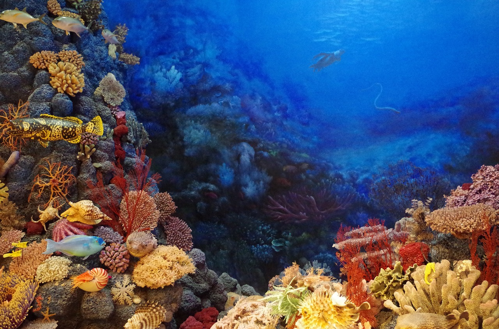

 
<html ng-app="myApp">
    <head><meta http-equiv="Content-Type" content="text/html; charset=windows-1252">
    <!-- Sources/dependencies (web and local)-->    
    
  <meta name="viewport" content="width=device-width, initial-scale=1">
  <link rel="stylesheet" href="https://maxcdn.bootstrapcdn.com/bootstrap/4.3.1/css/bootstrap.min.css">
  
  
  
  
 

    <!-- Sources/dependencies (web and local)-->
    </head>

<body>

  <title>non-universal beliefs</title>
  
 
  

<!-- Background image width is 100%-->
<!--thumbnail is text floating over the background image is relative-->

  <h1>Non-Universal Beliefs</h1>
  
follow your imagination
 

<nav class="navbar navbar-expand-sm bg-primary navbar-dark sticky-top" style="margin-bottom:0 ">

<ul class="navbar-nav">

<li class="nav-item active">
<a class="navbar-brand" href="#!" title="Website name">nubeliefs.com</a>
<!-- Toggler/collapsibe Button -->

  <button class="navbar-toggler fixed-right" type="button" data-toggle="collapse" data-target="#collapsibleNavbar">
    
  </button>

</li>

    <li class="nav-item">
      <a class="nav-link" href="#!about_us">About Us</a>
    </li>
    <li class="nav-item">
      <a class="nav-link" href="#!random_thoughts">Random Thoughts</a>
    </li>
    <li class="nav-item">
      <a class="nav-link" href="#!dreams_story">Dreams On</a>
    </li>
    <li class="nav-item">
      <a class="nav-link" href="#!youtube_journey">YouTube World</a>
    </li>

</ul>

</nav>

    

 

    

  ©nubeliefs.com | 2019

</body></html>
